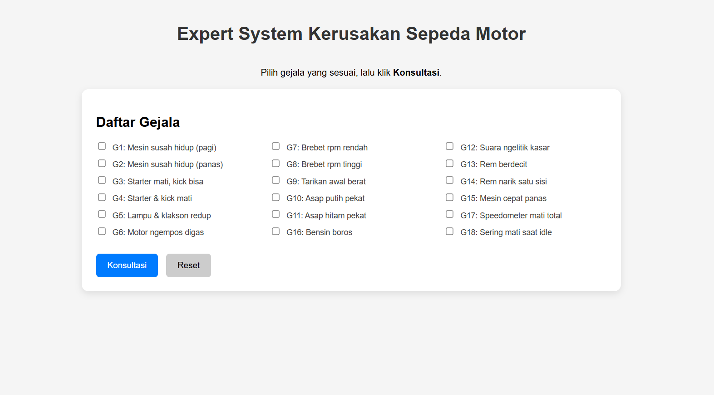
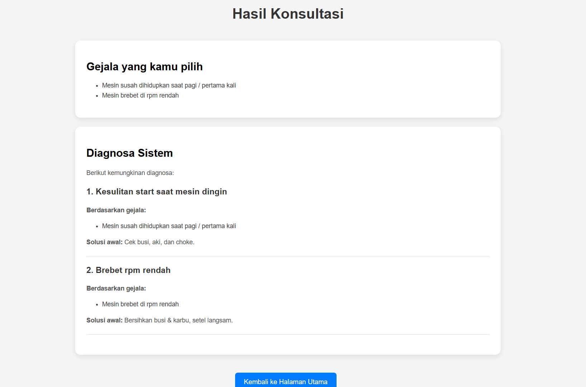
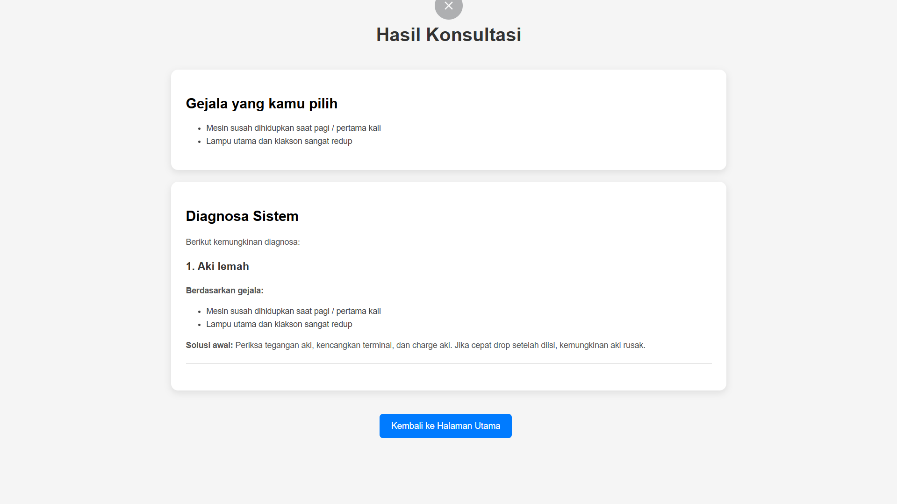

# 🏍️ Expert System: Diagnosa Kerusakan Sepeda Motor

Sistem Pakar (Expert System) berbasis web untuk mendiagnosa kerusakan pada sepeda motor. Aplikasi ini menggunakan metode **Forward Chaining** sederhana untuk mencocokkan gejala yang dipilih pengguna dengan basis pengetahuan (Knowledge Base) yang ada untuk memberikan solusi perbaikan.

Proyek ini merupakan hasil konversi/porting dari kode PHP Native menjadi **Python (Flask Framework)**.

## 📸 Tangkapan Layar (Screenshots)

Berikut adalah tampilan antarmuka aplikasi:

| Halaman Utama | Contoh Hasil Diagnosa 1 | Contoh Hasil Diagnosa 2 |
|:---:|:---:|:---:|
|  |  |  |

## 🛠️ Teknologi yang Digunakan

* **Backend:** Python 3.x
* **Framework:** Flask (Microframework)
* **Frontend:** HTML5, CSS3 (Responsive), JavaScript
* **Template Engine:** Jinja2

## 📂 Struktur Folder

```text
motor_diagnosa/
├── app.py              # Logika utama (Knowledge Base & Inference Engine)
├── static/             # Aset statis
│   ├── style.css       # Styling tampilan
│   └── script.js       # Validasi frontend
├── templates/          # File HTML (Jinja2)
│   ├── index.html
│   └── konsultasi_hasil.html
└── pic/                # Folder screenshot untuk README
